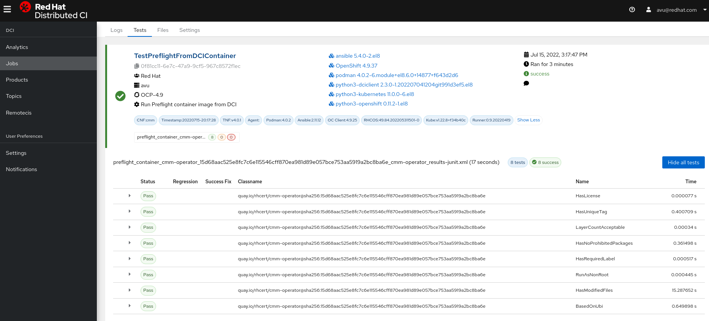
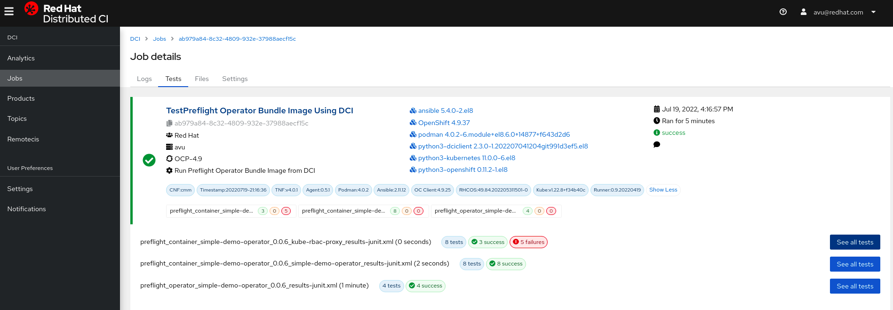
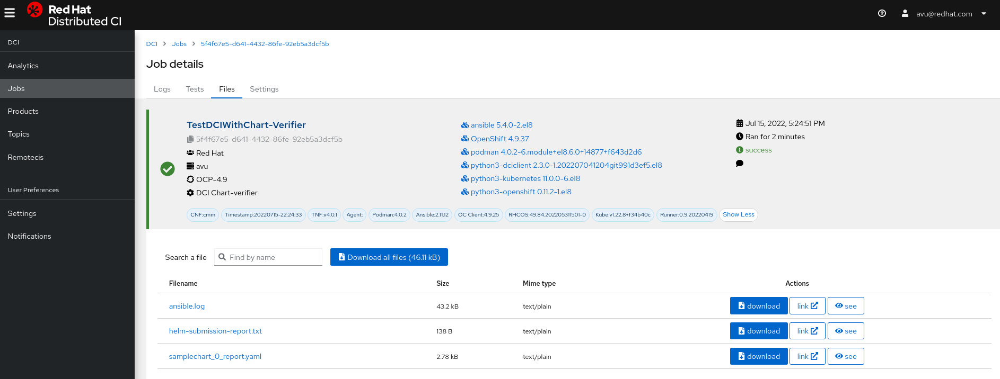
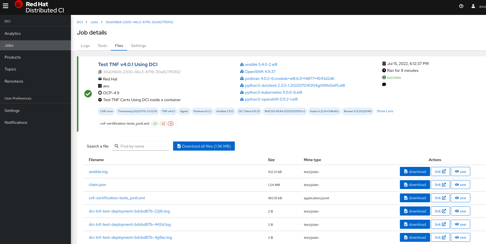

Table of Contents
=================

* [Run TNF, Chart-Verifier and Preflight Using DCI](#run-tnf-chart-verifier-and-preflight-using-dci)
   * [Purpose of this Repository](#purpose-of-this-repository)
   * [Pre-requisites](#pre-requisites)
   * [Build DCI container image with dci's requirements and preflight binary inside the image](#build-dci-container-image-with-dcis-requirements-and-preflight-binary-inside-the-image)
   * [Build DCI container image with dci's requirements only](#build-dci-container-image-with-dcis-requirements-only)
   * [Prepare and Deploy DCI Container using helm chart](#prepare-and-deploy-dci-container-using-helm-chart)
      * [Update helm chart values.yaml](#update-helm-chart-valuesyaml)
      * [Create Namespace and add SCC to SA user as priviledge](#create-namespace-and-add-scc-to-sa-user-as-priviledge)
      * [Label the SNO or master/worker nodes for DCI Container to Run On](#label-the-sno-or-masterworker-nodes-for-dci-container-to-run-on)
      * [Deploy DCI Container using helmchart](#deploy-dci-container-using-helmchart)
      * [DCI Container files structure are same as normal method](#dci-container-files-structure-are-same-as-normal-method)
      * [Scale out additional DCI Container for more users](#scale-out-additional-dci-container-for-more-users)
   * [Run TNF Test Suite, Helm Chart-Verifier and Preflight Manual](#run-tnf-test-suite-helm-chart-verifier-and-preflight-manual)
      * [TNF Test Suite Manual](#tnf-test-suite-manual)
      * [Chart-verifier Manual](#chart-verifier-manual)
      * [Preflight Manual](#preflight-manual)
   * [Start DCI runner TNF, chart-verifier and preflight](#start-dci-runner-tnf-chart-verifier-and-preflight)
      * [Shellscript start-dci-container-runner.sh usage](#shellscript-start-dci-container-runnersh-usage)
      * [Use DCI to Test Preflight with container image](#use-dci-to-test-preflight-with-container-image)
      * [Use DCI to Test Preflight with Operator Bundle Image](#use-dci-to-test-preflight-with-operator-bundle-image)
      * [Use DCI to run Chart-Verifier](#use-dci-to-run-chart-verifier)
      * [Use DCI to run TNF test Suite](#use-dci-to-run-tnf-test-suite)
* [Tips And Troubleshooting](#tips-and-troubleshooting)
   * [Tips](#tips)
      * [Upgrade DCI Repo](#upgrade-dci-repo)
      * [Force Re-install Ansible when face this Error](#force-re-install-ansible-when-face-this-error)
      * [Comment Out no_log for Debugging When Test the Preflight](#comment-out-no_log-for-debugging-when-test-the-preflight)
* [License](#license)
* [Contact](#contact)


# Run TNF, Chart-Verifier and Preflight Using DCI
## Purpose of this Repository

The main purpose of this repository is solely to show how to use DCI as centralize tool to run the following tests:
- [x] TNF Test Suite Certification
- [x] Helm Chart-verifier
- [x] Preflight to scan the image for CVE and security checking  

Additional, this respository will aim to show how to use DCI to test above 3 main catagories not just on traditional helper node or VM but also to do the demostration how to use DCI to run these 3 tests inside a Kubernetes Container, where you dont need to install DCI, preflight and helm chart requirements RPMs or libraries.
  
In matter of facts, it has an extra benefits, for example, the user can also a perform a scale out additional PODs in seconds to run DCI testing for different application on same or different clusters. Finally, this repository is also given the original manual methods of how to run these 3 tests without using DCI tool for references/troubleshooting purpose.  

**Note:** dci-runner.sh is from David, it will collect all components version and then added as dci_tags and show on the DCI CI Web Gui.  

## Pre-requisites
- One OAM subnet for secondary POD interface to reach https://www.distributed-ci.io as using for results/logs submission
- An Openshift cluster either SNO or Compact/Hub Cluster
- An account that can access to ci.io with DCI client-id and secrets https://www.distributed-ci.io/remotecis
- An real CNF application or a test-app that need to label them specifically and update to settings.yml
- Helm Chart testing needs to have a helmchart repository with index release if enable-helm-chart-testing  
  [Example-of-helm-chart-release](https://github.com/ansvu/samplechart2/releases/tag/samplechart-0.1.3)  
  Or Check out this document I made [Instruction-how-add-helm-chart-to-github](https://docs.google.com/presentation/d/1UEppK33-JMfCO4UzxgeDkL1zZpvIejdwv6lIM3tx4JY/edit?usp=sharing)  
  Or this more harder way original we used [Using CR tooling](https://docs.google.com/document/d/1pBkS0Z1mbbDZpKIytbTfPCSrMFayqUYZ6p2ngCxFkrU/edit?usp=sharing)
  
## Build DCI container image with dci's requirements and preflight binary inside the image
```diff
+ git clone https://github.com/redhat-openshift-ecosystem/openshift-preflight.git
+ podman build -t dci-container-tpc:v4 -f ./Dockerfile-WithPreflight
+ podman tag dci-container-tpc:v4 quay.io/avu0/dci-container-tpc:v1
+ podman push quay.io/avu0/dci-container-tpc:v4
```
  
## Build DCI container image with dci's requirements only
```diff
+ podman build -t dci-container-tpc:v3 -f ./Dockerfile
+ podman tag dci-container-tpc:v3 quay.io/avu0/dci-container-tpc:v3
+ podman push quay.io/avu0/dci-container-tpc:v3
```
  
## Prepare and Deploy DCI Container using helm chart
### Update helm chart values.yaml
```yaml
global:
  imagePullSecrets:
    enabled: false
    name: art-regcred
  nodeselector:
    enabled: false
    key: dci
    value: container

  repository: quay.io/avu0
  imagecredential:
    registry: quay.io
    username: avu0
    password: vkc8O9xxmM435IeqhkBb

image:
  dcipreflight:
    imgname: dci-container-tpc
    tag: v1
    pullPolicy: IfNotPresent

nameOverride: ""
fullnameOverride: ""

hook_delete_policy: "hook-failed"
serviceAccount:
  name: "dci-container-sa"

dcinetipvlan:
  name: ipvlan
  hostDevice: eno6
  type: static
  cidr: 192.168.30.0/27
  allocationPoolStartIp: 192.168.30.20
  allocationPoolEndIp: 192.168.30.21
  routes:
  - dst: 172.168.20.0/24
    gw: 192.168.30.1

securityContext:
  privileged: true
  capabilities:
    add: ["NET_ADMIN","NET_RAW","SYS_ADMIN"]        

resources:
  limits:
    cpu: 4
    memory: 4Gi
  requests:
    cpu: 2
    memory: 2Gi
```
- **Helm Chart Values Modification Options**  
   * ServiceAccount name and namespace must be used same name on step when add SCC privileged.
   * Adjust resources limits/requests of CPU and Memory according to your application SIZE.
   * Test TNF Cert with 40 PODs, CPU reached 1200mc(1.2vCPU) and Memory had reached to 1Gi.
   * NodeSelector that allow kubernetes to deploy DCI container on specific node true/false.
   * ImagePullSecret is enabled when you have a private registry server that need to be authenticated.

### Create Namespace and add SCC to SA user as priviledge
```diff
+ oc create namespace dci
+ oc add-scc-to-user privileged system:serviceaccount:dci:dci-container-sa
```
### Label the SNO or master/worker nodes for DCI Container to Run On
```diff
+ oc get no -o NAME | cut -d/ -f2|xargs -I V oc label node V dci=container
```
### Deploy DCI Container using helmchart
```diff
+ tree dci-container/
dci-container/
├── Chart.yaml
├── templates
│   ├── createdci-pdb.yaml
│   ├── deployment.yaml
│   ├── _helpers.tpl
│   ├── ImagePullSecret.tpl
│   ├── ImageRepoPullSecret.yaml
│   ├── ipvlan.yaml
│   └── serviceaccount.yaml
└── values.yaml
- ---------------------------------------------------------------------------------------------------------------------------------
+ helm install dci dci-container/ -n dci --wait
+ helm ls -n dci
NAME    NAMESPACE       REVISION        UPDATED                                 STATUS          CHART                   APP VERSION
dci     dci             1               2022-07-13 15:26:29.697521572 -0500 CDT deployed        dci-container-0.1.0              
+ oc get po -n dci
NAME                                 READY   STATUS    RESTARTS   AGE
dci-dci-container-7b9669f68d-pxwf4   1/1     Running   0          3m55s
+ oc exec -it dci-dci-container-7b9669f68d-pxwf4 -- bash -n dci
[root@dci-dci-container-7b9669f68d-pxwf4 /]# ip a
3: eth0@if16698: <BROADCAST,MULTICAST,UP,LOWER_UP> mtu 1400 qdisc noqueue state UP group default 
    link/ether 0a:58:0a:84:00:68 brd ff:ff:ff:ff:ff:ff link-netnsid 0
    inet 10.132.0.104/23 brd 10.132.1.255 scope global eth0
       valid_lft forever preferred_lft forever
    inet6 fe80::858:aff:fe84:68/64 scope link 
       valid_lft forever preferred_lft forever
4: net1@if9: <BROADCAST,MULTICAST,UP,LOWER_UP> mtu 1500 qdisc noqueue state UNKNOWN group default 
    link/ether 94:40:c9:c1:eb:69 brd ff:ff:ff:ff:ff:ff
    inet 192.168.30.20/27 brd 192.168.30.31 scope global net1
       valid_lft forever preferred_lft forever
    inet6 fe80::9440:c900:6c1:eb69/64 scope link 
       valid_lft forever preferred_lft forever

[root@dci-dci-container-7b9669f68d-pxwf4 /]# ping 192.168.30.1 -c3
PING 192.168.30.1 (192.168.30.1) 56(84) bytes of data.
64 bytes from 192.168.30.1: icmp_seq=1 ttl=64 time=0.493 ms
64 bytes from 192.168.30.1: icmp_seq=2 ttl=64 time=0.393 ms
64 bytes from 192.168.30.1: icmp_seq=3 ttl=64 time=0.365 ms
```
### DCI Container files structure are same as normal method
```bash
/etc/dci-openshift-app-agent
 ── dcirc.sh ---> contents of https://www.distributed-ci.io/remotecis
├── dcirc.sh.dist
├── hooks
│   ├── install.yml (--- dummy)
│   ├── post-run.yml
│   ├── pre-run.yml
│   ├── teardown.yml
│   └── tests.yml
├── hosts.yml
└── settings.yml ---> Each test type has different contents e.g. chart-verifier, preflight and TNF Cert

Other Files:
ls -1 /var/lib/dci-openshift-app-agent/
auth.json
dci-runner.sh
helm-charts-cmm.yml
kubeconfig
pyxis-apikey.txt
```

### Scale out additional DCI Container for more users
  - if there are more users need to test for different CNF application  
    we can scale out additional DCI Container PODs if NAD has a range of more than one IP Addreses
```diff
+ oc scale Deployment/dci-dci-container --replicas=2 -n dci
deployment.apps/dci-dci-container scaled
+ oc get po -n dci
NAME                                 READY   STATUS    RESTARTS   AGE
dci-dci-container-7b9669f68d-pxwf4   1/1     Running   0          42h
dci-dci-container-7b9669f68d-pzfj4   1/1     Running   0          12s
- ---------------------Second DCI Container PODs created in less 2s-------------------------------
+ oc exec -it dci-dci-container-7b9669f68d-pzfj4 -n dci -- bash -c 'ip a'
4: net1@if9: <BROADCAST,MULTICAST,UP,LOWER_UP> mtu 1500 qdisc noqueue state UNKNOWN group default 
    link/ether 94:40:c9:c1:eb:69 brd ff:ff:ff:ff:ff:ff
    inet 192.168.30.21/27 brd 192.168.30.31 scope global net1
       valid_lft forever preferred_lft forever
    inet6 fe80::9440:c900:7c1:eb69/64 scope link 
       valid_lft forever preferred_lft forever
+ oc exec -it dci-dci-container-7b9669f68d-pzfj4 -n dci -- bash -c 'ping -I net1 192.168.30.1'
PING 192.168.30.1 (192.168.30.1) from 192.168.30.21 net1: 56(84) bytes of data.
64 bytes from 192.168.30.1: icmp_seq=1 ttl=64 time=3.68 ms
64 bytes from 192.168.30.1: icmp_seq=2 ttl=64 time=0.329 ms       
```
  
## Run TNF Test Suite, Helm Chart-Verifier and Preflight Manual
### TNF Test Suite Manual
- **Using Podman**
```diff
+ podman run --rm --network host -v /root/openshift/install_dir/auth/kubeconfig:/usr/tnf/kubeconfig/config:Z -v /root/certification_6/test-network-function-main/test-network-function:/usr/tnf/config:Z -v /root/certification_6/output_lifecycle:/usr/tnf/claim:Z -e KUBECONFIG=/usr/tnf/kubeconfig/config -e TNF_MINIKUBE_ONLY=false -e TNF_NON_INTRUSIVE_ONLY=false -e TNF_DISABLE_CONFIG_AUTODISCOVER=false -e TNF_PARTNER_NAMESPACE=npv-cmm-34 -e LOG_LEVEL=debug -e PATH=/usr/bin:/usr/local/oc/bin quay.io/testnetworkfunction/test-network-function:v4.0.1 
```
- **Using Container Shellscript(Podman as default)**  
  - **Example of TNF CONFIG**  
  Make sure you have a targetNameSpaces tnf or any other Namespace with PODs are running  
```yaml
targetNameSpaces:
  - name: tnf
targetPodLabels:
  - prefix: test-network-function.com
    name: generic
    value: target
targetCrdFilters:
  - nameSuffix: "group1.test.com"
  - nameSuffix: "test-network-function.com"
certifiedcontainerinfo:
  - name: nginx-116  # working example
    repository: rhel8
certifiedoperatorinfo:
  - name: etcd
    organization: community-operators # working example
```
   - **TNF Directory Structure**
```bash
tree tnf/
tnf/
├── claim
├── config
│   └── tnf_config.yml
├── kubeconfig.westd1
├── output
│   ├── claim.json
│   └── cnf-certification-tests_junit.xml
└── tnf_config.yml
```
```diff
+ ./run-tnf-container.sh -k ~/.kube/config -t ~/tnf/config -o ~/tnf/output -f networking access-control -s access-control-host-resource-PRIVILEGED_POD
+ ./run-tnf-container.sh -i quay.io/testnetworkfunction/test-network-function:v4.0.1 -o ~/tnf/output/ -k ~/tnf/config/kubeconfig.westd1 -t ~/tnf/config -f platform-alteration -s platform-alteration-tainted-node-kernel -s platform-alteration-hugepages-config
```
   - **TNF Cert Links**  
https://github.com/test-network-function/cnf-certification-test#general-tests  
https://redhat-connect.gitbook.io/openshift-badges/badges/cloud-native-network-functions-cnf  

### Chart-verifier Manual  
- **Check current-context belong to your CNF Namespace**
  - Edit the kubeconfig then search current-context and update to your CNF application namespace
  - Or use oc config cmd, so if current-context name is not YOURs, then do following:
```bash
#Check Current-Context#
oc config current-context
mvnr-du/api-nokiavf-hubcluster-1-lab-eng-cert-redhat-com:6443/system:admin

#Current-context is NOT avachart#
#Get a list of contexts and search for CNF Namespace#
oc config get-contexts |grep avachart
CURRENT   NAME                                                                                 CLUSTER                                                 AUTHINFO                                                             NAMESPACE
          admin                                                                                nokiavf                                                 admin                                                                
*         avachart/api-nokiavf-hubcluster-1-lab-eng-cert-redhat-com:6443/system:admin          api-nokiavf-hubcluster-1-lab-eng-cert-redhat-com:6443   system:admin/api-nokiavf-hubcluster-1-lab-eng-cert-redhat-com:6443   avachart

#set current-context as in your Namespace#
oc config use-context avachart/api-nokiavf-hubcluster-1-lab-eng-cert-redhat-com:6443/system:admin
```
  
- **Example of run chart-verifier from podman**
```bash
podman run -e KUBECONFIG=/ava/kubeconfig.sno -v ${PWD}:/ava:Z  \
       --rm   quay.io/redhat-certification/chart-verifier verify /ava/samplechart \
       --config /ava/config.yaml -F /ava/values.yaml
```

**Example of running chart-verifier from binary(chart-verifier with set values)**
```bash
BUILD_ID="avachart"
NAMESPACE="avachart"
RELEASE=""
./chart-verifier                                                  \
    verify                                                        \
    --set chart-testing.buildId=${BUILD_ID}                       \
    --set chart-testing.upgrade=false                             \
    --set chart-testing.skipMissingValues=true                    \
    --set chart-testing.namespace=${NAMESPACE}                    \
    --set chart-testing.releaseLabel="app.kubernetes.io/instance" \
    samplechart
```
**Example of running chart-verifier from binary(chart-verifier with --config option)**

**config.yaml:**
```yaml
chart-testing:
    buildId: avachart
    upgrade: false
    skipMissingValues: true
    namespace: avachart
    releaseLabel: "app.kubernetes.io/instance"
```
```bash
./chart-verifier verify --config config.yaml samplechart-0.1.2.tgz
```
**More example of options/arguments can be found in these links:**  
Chart-Verifier homepage: [chart-verifier](https://github.com/redhat-certification/chart-verifier). More Options and examples:
[chart-verifier-opions](https://github.com/redhat-certification/chart-verifier/blob/main/docs/helm-chart-checks.md#chart-testing)  
<br />

**WARNING on Chart-verifier Cache/chart-verifier** 

**Note:** So sometime you updated or modified something on the helm chart, when you re-run the test, it takes the old info from previous data
          that is from this directory the ~/.cache/chart-verifier/.  
          To avoid this issue, you can delete these contents under ~/.cache/chart-verifier/.
```bash
ls -1 ~/.cache/chart-verifier/
samplechart
samplechart_0_1_2_tgz
```
### Preflight Manual  
- **Run Preflight on Helper Node/VM**
```diff
+ preflight check container quay.io/rhcert/cmm-aimpaps@sha256:de3ce3f26db61a11c1e97018605670fd6bd01b47b31b4250a7e30b4f5bb16exx --certification-project-id 628b8f2819e6793741575dxx --pyxis-api-token ff7xuabtckq35060wjvuow4ruky83txx -d /var/lib/dci-openshift-app-agent/auth.json
```
- **Similarly Run Preflight Inside Container**
```diff
[root@dci-chart-dci-container-f779b9b6-zt6xn /]# 
+ preflight check container quay.io/rhcert/cmm-aimpaps@sha256:de3ce3f26db61a11c1e97018605670fd6bd01b47b31b4250a7e30b4f5bb16exx --certification-project-id 628b8f2819e6793741575dxx --pyxis-api-token ff7xuabtckq35060wjvuow4ruky83txx -d /root/auth.json
```
**More Options from Preflight Main Site**  
https://github.com/redhat-openshift-ecosystem/openshift-preflight
  
## Start DCI runner TNF, Chart-Verifier and Preflight  

**Note:** Using DCI to run preflight with container image is not supported and the function was removed During the test.  
DCI Developer team had added the feature back to support DCI to run with Preflight on container image as described on this Jira  
https://issues.redhat.com/browse/CILAB-685  

###  Shellscript start-dci-container-runner.sh usage
```bash
./start-dci-container-runner.sh
------------------------------------------------------------------------------------------------------------------------
Usage: bash ./start-dci-container-runner.sh  -ns|--namespace <NS_Of_Dci_Container> -tt|--type <PREFLIGHT|TNF|CHART> -pn|--podname    <Name_Of_DCI_Container_POD> -sk|--skip-copy <yes|no>
Usage: bash ./start-dci-container-runner.sh [-h | --help]

Usage ex: bash ./start-dci-container-runner.sh --namespace dci --type CHART --podname dci-dci-container-xxxxx --skip-copy no
          bash ./start-dci-container-runner.sh --namespace dci --type PREFLIGHT --podname dci-dci-container-xxxxx

Note: --skip-copy   --- default is no, it always needs to copy those requirement files to DCI Container POD.
------------------------------------------------------------------------------------------------------------------------
```
  
### Use DCI to Test Preflight with container image
  - **Settings Contents for Preflight**
```yaml
---
dci_topic: OCP-4.9
dci_name: DCI Preflight Mavenir DU
dci_configuration: Run Preflight container image from DCI Submission
#do_preflight_tests: true
preflight_test_certified_image: true
partner_creds: "/var/lib/dci-openshift-app-agent/auth.json"
preflight_containers_to_certify:
  #- container_image: "quay.io/rhcert/cmm-aimpaps@sha256:de3ce3f26db61a11c1e97018605670fd6bd01b47b31b4250a7e30b4f5bb16e2d"
  - container_image: "quay.io/mrhcert/5gdu@sha256:0dcdc3033eba164b49efae8394bf7a4d050149f6524b0475b82fd3151062515d"
    pyxis_container_identifier: "628b8f2819e6793741575daa"

pyxis_apikey_path: "/var/lib/dci-openshift-app-agent/pyxis-apikey.txt"
```
**Note:** To skip image submission to catalog/connect.redhat.com, please comment out those pyxis parameters
          If there are more than one container images to be tested, the add more '- container_image' under preflight_containers_to_certify

  - **Files structure Of Preflight**
```bash
tree dci-container-with-preflight
dci-container-with-preflight
├── auth.json
├── dcirc.sh
├── dci-runner.sh
├── install.yml
├── kubeconfig
├── pyxis-apikey.txt
├── settings-preflight-container-image.yml
├── settings-preflight-operator.yml
├── settings.yml
├── start-dci-container-runner.sh
```
  
   - **Start DCI Container Runner to test Preflight Container Image with Submission**
```diff
+ bash start-dci-container-runner.sh --namespace dci --type PREFLIGHT --podname dci-dci-container-7b9669f68d-pxwf4
Already on project "dci" on server "https://api.nokiavf.hubcluster-1.lab.eng.cert.redhat.com:6443".
22/07/15 15:17:16 INFO : Copying settings.yml, install.yml, dci-runner.sh, dcirc.sh and kubeconfig and other files for Preflight/HelmChart to to dci-dci-container-7b9669f68d-pxwf4
22/07/15 15:17:27 INFO : Start DCI Container Runner for PREFLIGHT Test Type...........
20220715-20:17:28 Uses resource /etc/dci-openshift-app-agent/dcirc.sh.
......
```
```bash
TASK [Final step] ******************************************************************************************************************************************************
ok: [jumphost] => {
    "msg": "The job is now finished. Review the log at: https://www.distributed-ci.io/jobs/a9ed6107-4446-4d6f-8635-dfa2b2fa69d5/jobStates"
}

PLAY RECAP *******************************************************************************************************************************************************
jumphost                   : ok=114  changed=36   unreachable=0    failed=0    skipped=32   rescued=0    ignored=1   
```



    
### Use DCI to Test Preflight with Operator Bundle Image  
**Note:** On a connected environment, index_image parameter is MANDATORY!  

  - **Settings Contents for Preflight Operator Bundle Images**
```yaml
---
dci_topic: OCP-4.9
dci_name: TestPreflight Operator Bundle Image Using DCI
dci_configuration: Run Preflight Operator Bundle Image from DCI
partner_creds: "/var/lib/dci-openshift-app-agent/auth.json"
do_preflight_tests: true
#preflight_test_certified_image: true
preflight_operators_to_certify:
  - bundle_image: "quay.io/opdev/simple-demo-operator-bundle:v0.0.6"
    index_image: "quay.io/opdev/simple-demo-operator-catalog:v0.0.6"
    # https://connect.redhat.com/projects/628b8f2819e6793741575daa/overview
    pyxis_container_identifier: "628b8f2819e6793741575daa"

# To generate it: connect.redhat.com -> Product certification -> Container API Keys -> Generate new key
pyxis_apikey_path: "/var/lib/dci-openshift-app-agent/pyxis-apikey.txt"
```
  - **When Testing Preflight with Operator Bundle image**  
    The CNF operator image must be compiled as Bundle and reference indices to other images.
  - **Partner should follow this procedure** [Build-Operator-Bundle-Image](https://olm.operatorframework.io/docs/tasks/creating-operator-bundle)  

   - **Start DCI Container Runner to test Preflight Operator Bundle Image**
```diff
+ bash start-dci-container-runner.sh --namespace dci --type PREFLIGHT --podname dci-dci-container-7b9669f68d-pxwf4
22/07/19 16:16:24 INFO : Copying pyxis-apikey.txt and auth.json files to dci-dci-container-f5755784-mxs44:/var/lib/dci-openshift-app-agent
22/07/19 16:16:28 INFO : Copying settings.yml, install.yml, dci-runner.sh, dcirc.sh and kubeconfig to dci-dci-container-f5755784-mxs44:/etc/dci-openshift-app-agent/
22/07/19 16:16:35 INFO : Start DCI Container Runner for PREFLIGHT Testing Type....
20220719-21:16:36 Uses resource /etc/dci-openshift-app-agent/dcirc.sh.
```
```bash
TASK [Final step] **************************************************************
ok: [jumphost] => {
    "msg": "The job is now finished. Review the log at: https://www.distributed-ci.io/jobs/ab979a84-8c32-4809-932e-37988aecf15c/jobStates"
}

PLAY RECAP *********************************************************************
jumphost                   : ok=187  changed=69   unreachable=0    failed=0    skipped=47   rescued=0    ignored=4   
```


  
  - **Links for more options of using DCI to Run Preflight**  
    https://github.com/redhat-cip/dci-openshift-app-agent/blob/master/roles/preflight/README.md    
    https://github.com/redhat-openshift-ecosystem/openshift-preflight/blob/main/docs/RECIPES.md
    https://github.com/redhat-cip/dci-openshift-app-agent/tree/master/roles/preflight#operator-end-to-end-certification
  
### Use DCI to run Chart-Verifier  
  - **Settings Contents for Chart-Verifier**
```yaml
settings.yml:
---
dci_topic: OCP-4.9
dci_name: TestDCIWithChart-Verifier
dci_configuration: DCI Chart-verifier
dci_openshift_app_image: quay.io/testnetworkfunction/cnf-test-partner:latest
do_chart_verifier: true
dci_openshift_app_ns: avachart
dci_teardown_on_success: false
dci_disconnected: false
```
- **Helm Config for Chart-Verifier**  
```yaml
helm_config.yaml:
partner_name: telcoci CMM
partner_email: telco.cmm@nokia.com
github_token_path: "/opt/cache/token.txt"
dci_charts:
  -
    name: sameplechart2
    chart_file: https://github.com/ansvu/samplechart2/releases/download/samplechart-0.1.3/samplechart-0.1.3.tgz
    #chart_values: https://github.com/ansvu/samplechart2/blob/main/samplechart/values.yaml
    #install: true
    deploy_chart: true
    create_pr: false
```
  - **Files structure of Chart-Verifier**
```bash
tree dci-container-with-preflight
dci-container-with-preflight
├── dcirc.sh
├── dci-runner.sh
├── install.yml
├── kubeconfig
├── settings.yml
├── helm_config.yaml
├── github_token.txt
├── start-dci-container-runner.sh
```
   - **Start DCI Container Runner to test Chart-Verifier**
```diff
+ bash start-dci-container-runner.sh --namespace dci --type CHART --podname dci-dci-container-7b9669f68d-pxwf4
```
```bash
TASK [Final step] **************************************************************
ok: [jumphost] => {
    "msg": "The job is now finished. Review the log at: https://www.distributed-ci.io/jobs/5f4f67e5-d641-4432-86fe-92eb5a3dcf5b/jobStates"
}

PLAY RECAP *********************************************************************
jumphost                   : ok=113  changed=37   unreachable=0    failed=0    skipped=37   rescued=0    ignored=1     
```


  - **Links for more options of using DCI to Run Chart-Verifier**  
    https://github.com/redhat-cip/dci-openshift-app-agent/blob/master/roles/chart-verifier/README.md  
    https://github.com/redhat-certification/chart-verifier/blob/main/docs/helm-chart-checks.md#run-helm-chart-checks  
    https://github.com/redhat-certification/chart-verifier
    
### Use DCI to run TNF test Suite  
  - **Settings Contents for TNF Test Suite**
```yaml
---
dci_topic: OCP-4.9
dci_name: Test TNF v4.0.1 Using DCI
dci_configuration: Test TNF Certs Using DCI inside a container
do_cnf_cert: true
dci_openshift_app_image: quay.io/testnetworkfunction/cnf-test-partner:latest
tnf_suites: >-
  access-control
  networking
  observability
  platform-alteration
tnf_postrun_delete_resources: false
dci_openshift_app_ns: dci-tnf-test
dci_teardown_on_success: false
tnf_log_level: trace
dci_disconnected: false
tnf_config:
  - namespace: dci-tnf-test
    targetpodlabels:
      - app=dci-tnf-test
    operators_regexp:
    exclude_connectivity_regexp:
test_network_function_version: v4.0.1
```
  - **Files structure of Chart-Verifier**
```bash
tree dci-container-with-preflight
dci-container-with-preflight
├── dcirc.sh
├── dci-runner.sh
├── install.yml
├── kubeconfig
├── settings.yml
├── start-dci-container-runner.sh
```
   - **Start DCI Container Runner to test TNF Certification**
```diff
+ bash start-dci-container-runner.sh --namespace dci --type TNF --podname dci-dci-container-7b9669f68d-pxwf4
```
```bash
TASK [Final step] **************************************************************
ok: [jumphost] => {
    "msg": "The job is now finished. Review the log at: https://www.distributed-ci.io/jobs/30a016b8-2300-46c3-87f8-30e827f51102/jobStates"
}

PLAY RECAP *********************************************************************
jumphost                   : ok=216  changed=90   unreachable=0    failed=0    skipped=50   rescued=0    ignored=1    
```


  - **Links for more options of using DCI to Run TNF Test Suite**  
    https://github.com/redhat-cip/dci-openshift-app-agent/tree/master/roles/cnf-cert  
    https://github.com/test-network-function/cnf-certification-test
    https://github.com/test-network-function/cnf-certification-test#general-tests
 
# Tips And Troubleshooting 
## Tips
### Upgrade DCI Repo
- **Traditional Method (Non-DCI Container)
```diff
+ sudo dnf upgrade --refresh --repo dci --skip-broken --nobest
```
- **DCI Container**
  - Just need to re-build Dockerfile, then new DCI Repo will be upgraded
  
### Force Re-install Ansible when face this Error
- **Ansible Force Reinstall**
  - Ansible Error
```yaml
Deprecation warnings can be disabled by setting deprecation_warnings=False in ansible.cfg.
[WARNING]: Skipping plugin (/usr/share/dci/callback/dci.py) as it seems to be invalid: No module named 'dciauth'
ERROR! Unexpected Exception, this is probably a bug: No module named 'dciauth'
```
  - Work Around
```diff
+ pip3 install --force-reinstall ansible
```
- **Downloading Metadata for Repository Error**
```yaml
Errors during downloading metadata for repository 'rhel-8-for-x86_64-appstream-rpms': 
- Curl error (58): Problem with the local SSL certificate for https://cdn.redhat.com/content/dist/rhel8/8/x86_64/appstream/os/repodata/repomd.xml [could not load PEM client certificate, OpenSSL error error
```
  - Solution
```diff
sudo dnf clean all
sudo rm -r /var/cache/dnf
```
**Note:** For DCI Container Dockerfile, it takes care automatically.
  
### Comment Out no_log for Debugging When Test the Preflight  

- **When Test Preflight with issue occurr, there is no details log**
  - Error:
```yaml
ERROR: fatal: [jumphost]: FAILED! => {"censored": "the output has been hidden due to the fact that 'no_log: true' was specified for this result"}
```
- **Enable no_log from Ansible Test Preflight Check Container**
```diff
+ Edit /usr/share/dci-openshift-app-agent/roles/preflight/tasks/test_preflight_check_container_binary.yml
+ no_log: true ---> #no_log: true
+ https://github.com/redhat-cip/dci-openshift-app-agent/blob/master/roles/preflight/tasks/test_preflight_check_container_binary.yml#L24
```

# License
Apache License, Version 2.0 (see LICENSE file)

# Contact
Email: Distributed-CI Team distributed-ci@redhat.com  
Email: avu@redhat.com or yinwang@redhat.com for any issue related when using DCI to test/run inside a container


